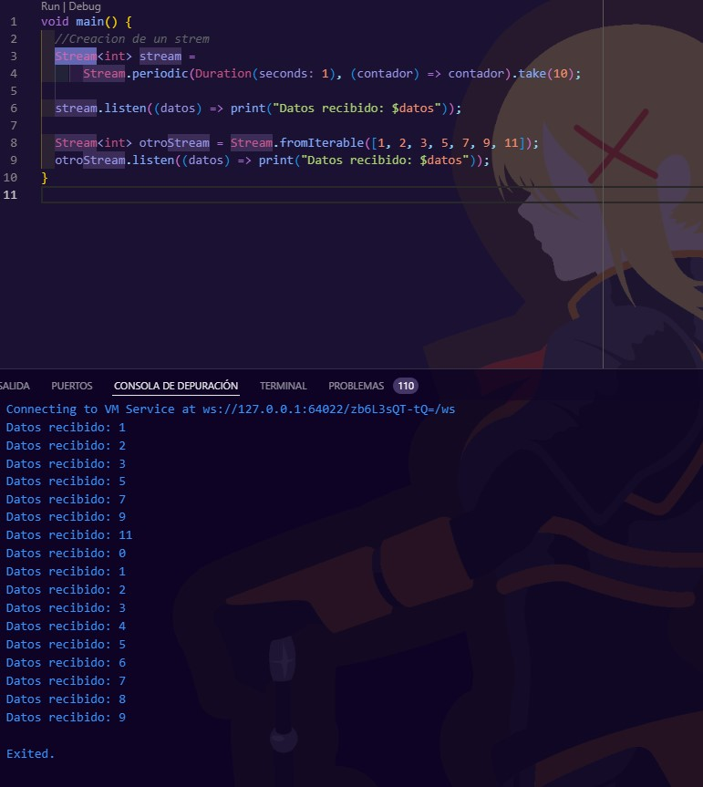

# Proyecto de Evaluación

## Índice

1. [Ejercicios 01 al 04](#ejercicios-01-al-04)
2. [Ejercicios 05 al 08](#ejercicios-05-al-08)
3. [Ejercicios 09 al 15](#ejercicios-09-al-15)
4. [Aplicaciones](#aplicaciones)
    - [Aplicación HelloWorld](#aplicación-helloworld)
    - [Aplicación YesOrNo](#aplicación-yesorno)
5. [Presentación Presencial](#presentación-presencial)
    - [Arquitectura Limpia](#arquitectura-limpia)
    - [Diseño Responsivo](#diseño-responsivo)
    - [Interacción con Widgets](#interacción-con-widgets)
    - [Widgets Personalizados](#widgets-personalizados)

## Ejercicios 01 al 04

### 01: Hello World (0.25 puntos)

### 02: Variables (0.25 puntos)

### 03: Maps (0.25 puntos)

### 04: List, Maps and Iterables (0.25 puntos)

## Ejercicios 05 al 08

### 05: Functions (0.25 puntos)

### 06: Classes (0.25 puntos)

### 07: Constructors and Names (0.25 puntos)

### 08: Get and Set (0.25 puntos)

### Resultado

## Ejercicios 09 al 15

### 09: Abstract Class (0.25 puntos)

### 10: Mixins (0.5 puntos)

### 11: Futures (0.25 puntos)

### 12: Async Await (0.25 puntos)

### 13: Try Catch Finally (0.25 puntos)

### 14: Streams (0.25 puntos)

### 15: Stream Await (0.25 puntos)

## Aplicaciones

### Aplicación HelloWorld (0.5 puntos)

### Aplicación YesOrNo (0.5 puntos)

## Presentación Presencial

### Arquitectura Limpia

El proyecto implementa la arquitectura limpia, dividida en las siguientes capas:

#### Capa App

#### Capa Config

#### Capa Domain

#### Capa Infrastructure

#### Capa Presentation

### Diseño Responsivo

Se ha implementado un diseño responsivo siguiendo las guías de Material Design UI.

### Interacción con Widgets

La aplicación interactúa utilizando los estados StatelessWidget y StatefulWidget.

### Widgets Personalizados

Se han creado widgets personalizados para su reutilización en la aplicación.

